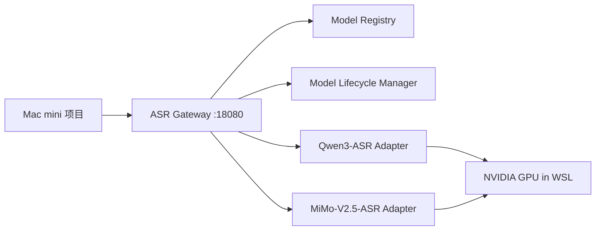

# WSL ASR Server PRD

更新时间：2026-06-26

## 1. 背景

当前 Windows 主机已通过 WSL2 Arch Linux 暴露局域网服务，Mac mini 已验证可以访问 WSL mirrored networking 下的局域网服务。目标是在 WSL 内常驻一个 ASR 服务，让 Mac mini 上的本地项目可以通过 HTTP API 调用 Windows/WSL 内的 GPU 模型完成音频转录。

首批支持模型：

- QwenLM/Qwen3-ASR：https://github.com/QwenLM/Qwen3-ASR
- XiaomiMiMo/MiMo-V2.5-ASR：https://github.com/XiaomiMiMo/MiMo-V2.5-ASR

硬件前提：

- Windows 主机：RTX 5070 Ti 16GB VRAM
- WSL：Arch Linux，已启用 mirrored networking
- WSL 资源：32GB RAM，12 CPUs，16GB swap
- 局域网入口建议：`http://192.168.31.137:18080`

## 2. 目标

构建一个常驻 WSL 后台的统一 ASR 网关，屏蔽 Qwen3-ASR 与 MiMo-V2.5-ASR 的模型差异，对 Mac mini 提供稳定、可探测、可管理、可扩展的 API。

必须支持：

- 查询服务健康状态。
- 查询 ASR 服务端支持哪些模型、每个模型的能力与加载状态。
- 请求加载指定模型。
- 请求卸载指定模型或全部模型。
- 卸载模型时保证当前正在执行的请求完成后再卸载，并拒绝新的同模型请求。
- 上传音频并获取转写结果。
- 对 Qwen3-ASR 暴露时间戳、强制对齐、流式转写等可选能力。
- 对 MiMo-V2.5-ASR 暴露语言提示、离线高质量转写能力。

暂不做：

- 公网访问。
- 多用户计费。
- 分布式多机调度。
- Web 管理后台。
- Windows Docker 部署。

## 3. 用户与场景

主要用户是 Mac mini 上的本地开发项目。

典型场景：

1. Mac 项目启动时调用 `GET /v1/models`，发现服务端可用模型与能力。
2. Mac 项目上传音频到 `POST /v1/audio/transcriptions`，指定 `model=qwen3-asr-1.7b` 或 `model=mimo-v2.5-asr`。
3. 长音频或批处理时，Mac 项目创建异步任务，再轮询任务状态。
4. 长时间不用某个模型时，Mac 项目或运维脚本调用卸载接口释放显存。
5. 如果服务端正在处理请求，卸载动作进入排队状态，当前请求结束后再释放模型。

## 4. 总体架构

采用单一 HTTP 网关加模型适配器结构。



建议进程：

- `asr-gateway`：对 Mac 暴露 HTTP API，监听 `0.0.0.0:18080`。
- `qwen-adapter`：可先内嵌在 gateway 进程内，后续如需 vLLM serving 再拆成独立 worker。
- `mimo-adapter`：可先内嵌在 gateway 进程内。

端口规划：

- `18080`：唯一对 Mac mini 暴露的正式 ASR API 入口。服务进程运行在 WSL Arch Linux 内，监听 `0.0.0.0:18080`；Windows 侧只需要为这个端口添加专用网络入站防火墙规则。
- `8001`：可选的 WSL 内部 Qwen3-ASR worker 端口。只有当后续把 Qwen 适配器拆成独立 worker 进程时才使用；默认第一版不需要开放。若启用，必须只绑定 WSL 内部 loopback 或 Unix socket，不为 Windows 防火墙添加入站规则，不对 Mac mini 暴露。
- `8002`：可选的 WSL 内部 MiMo-V2.5-ASR worker 端口。只有当后续把 MiMo 适配器拆成独立 worker 进程时才使用；默认第一版不需要开放。若启用，必须只绑定 WSL 内部 loopback 或 Unix socket，不为 Windows 防火墙添加入站规则，不对 Mac mini 暴露。

历史测试端口 `8765` 不属于正式设计，不应写入部署、启动、自启或防火墙配置。正式验收只使用 `18080`。

## 5. 模型能力矩阵

| 模型 | 模型 ID | 首选用途 | 支持能力 | 限制 |
| --- | --- | --- | --- | --- |
| Qwen3-ASR 0.6B | `qwen3-asr-0.6b` | 轻量转写、较低显存占用 | 离线转写、语言提示、时间戳、强制对齐、可接 vLLM | 质量和复杂音频能力弱于 1.7B |
| Qwen3-ASR 1.7B | `qwen3-asr-1.7b` | 默认主力模型 | 离线转写、流式转写、语言提示、长音频、歌声/BGM、时间戳、强制对齐、vLLM serving | 流式与部分高级能力依赖 Qwen 官方后端支持 |
| MiMo-V2.5-ASR | `mimo-v2.5-asr` | 中文/英文、方言、噪声、多说话人、歌声、知识密集音频 | 离线转写、语言提示、自动语言、原生标点 | 不作为第一版流式模型；如无官方时间戳接口，统一返回无时间戳 |

## 6. API 设计

### 6.1 健康检查

`GET /health`

返回：

```json
{
  "status": "ok",
  "version": "0.1.0",
  "host": "archlinux-wsl",
  "gpu": {
    "available": true,
    "name": "NVIDIA GeForce RTX 5070 Ti",
    "vram_total_mb": 16303
  }
}
```

### 6.2 查询模型

`GET /v1/models`

返回：

```json
{
  "models": [
    {
      "id": "qwen3-asr-1.7b",
      "provider": "QwenLM",
      "status": "unloaded",
      "default": true,
      "capabilities": {
        "transcription": true,
        "streaming": true,
        "timestamps": ["word", "char"],
        "forced_alignment": true,
        "languages": ["auto", "zh", "en", "yue", "ar", "de", "fr", "es", "pt", "id", "it", "ko", "ru", "th", "vi", "ja", "tr", "hi", "ms", "nl", "sv", "da", "fi", "pl", "cs", "fil", "fa", "el", "hu", "mk", "ro"],
        "chinese_dialects": ["Anhui", "Dongbei", "Fujian", "Gansu", "Guizhou", "Hebei", "Henan", "Hubei", "Hunan", "Jiangxi", "Ningxia", "Shandong", "Shaanxi", "Shanxi", "Sichuan", "Tianjin", "Yunnan", "Zhejiang", "Cantonese-Hong-Kong-accent", "Cantonese-Guangdong-accent", "Wu", "Minnan"],
        "backends": ["transformers", "vllm"]
      }
    },
    {
      "id": "mimo-v2.5-asr",
      "provider": "XiaomiMiMo",
      "status": "unloaded",
      "default": false,
      "capabilities": {
        "transcription": true,
        "streaming": false,
        "timestamps": [],
        "forced_alignment": false,
        "languages": ["auto", "zh", "en"],
        "backends": ["transformers"]
      }
    }
  ]
}
```

### 6.3 查询单个模型状态

`GET /v1/models/{model_id}/status`

状态枚举：

- `unloaded`
- `loading`
- `loaded`
- `unloading_scheduled`
- `unloading`
- `error`

返回：

```json
{
  "id": "qwen3-asr-1.7b",
  "status": "loaded",
  "active_requests": 1,
  "rejecting_new_requests": false,
  "backend": "transformers",
  "loaded_at": "2026-06-26T21:30:00+08:00",
  "last_used_at": "2026-06-26T21:34:12+08:00",
  "vram_allocated_mb": 7420
}
```

### 6.4 加载模型

`POST /v1/models/{model_id}/load`

请求：

```json
{
  "backend": "auto",
  "device": "cuda",
  "dtype": "auto"
}
```

返回：

```json
{
  "id": "qwen3-asr-1.7b",
  "status": "loading",
  "message": "model loading started"
}
```

### 6.5 卸载单个模型

`DELETE /v1/models/{model_id}`

请求：

```json
{
  "mode": "after_current_requests",
  "reject_new_requests": true,
  "cuda_empty_cache": true
}
```

语义：

- 如果模型没有正在运行的请求，立即卸载。
- 如果模型有正在运行的请求，立刻把状态改为 `unloading_scheduled`。
- 状态为 `unloading_scheduled` 后，新的同模型转写请求返回 `409 model_unloading_scheduled`。
- 已经开始的请求正常完成。
- 最后一个活跃请求结束后执行卸载并清理 CUDA cache。

返回：

```json
{
  "id": "qwen3-asr-1.7b",
  "status": "unloading_scheduled",
  "active_requests": 2,
  "rejecting_new_requests": true
}
```

### 6.6 卸载全部模型

`DELETE /v1/models`

请求：

```json
{
  "mode": "after_current_requests",
  "reject_new_requests": true,
  "cuda_empty_cache": true
}
```

返回：

```json
{
  "status": "accepted",
  "models": [
    {
      "id": "qwen3-asr-1.7b",
      "status": "unloading_scheduled",
      "active_requests": 1
    },
    {
      "id": "mimo-v2.5-asr",
      "status": "unloaded",
      "active_requests": 0
    }
  ]
}
```

### 6.7 同步转写

`POST /v1/audio/transcriptions`

Content-Type: `multipart/form-data`

字段：

- `file`：音频文件，必填。
- `model`：模型 ID，默认 `qwen3-asr-1.7b`。
- `language`：`auto`、`zh`、`en` 等，默认 `auto`。
- `response_format`：`json`、`text`、`verbose_json`，默认 `json`。
- `timestamps`：`none`、`word`、`char`，默认 `none`。
- `backend`：`auto`、`transformers`、`vllm`，默认 `auto`。
- `temperature`：可选。
- `max_new_tokens`：可选。

返回：

```json
{
  "id": "tr_01JZ0000000000000000000000",
  "model": "qwen3-asr-1.7b",
  "backend": "transformers",
  "language": "zh",
  "text": "这是转写结果。",
  "duration": 12.35,
  "timestamps": [
    {
      "start": 0.0,
      "end": 1.24,
      "text": "这是"
    }
  ],
  "segments": [],
  "usage": {
    "audio_seconds": 12.35
  },
  "warnings": []
}
```

### 6.8 强制对齐

`POST /v1/audio/alignments`

首版仅 Qwen3-ASR 支持。

Content-Type: `multipart/form-data`

字段：

- `file`：音频文件，必填。
- `text`：需要对齐的文本，必填。
- `model`：默认 `qwen3-asr-1.7b`。
- `language`：默认 `auto`。
- `granularity`：`word` 或 `char`。

返回：

```json
{
  "id": "al_01JZ0000000000000000000000",
  "model": "qwen3-asr-1.7b",
  "language": "zh",
  "granularity": "char",
  "items": [
    {
      "text": "这",
      "start": 0.0,
      "end": 0.18
    }
  ]
}
```

如果请求 MiMo：

```json
{
  "error": {
    "code": "capability_not_supported",
    "message": "mimo-v2.5-asr does not support forced alignment in this server"
  }
}
```

### 6.9 异步任务

第一版可以先不实现，但接口预留如下：

- `POST /v1/audio/transcription-jobs`
- `GET /v1/jobs/{job_id}`
- `DELETE /v1/jobs/{job_id}`

适合长音频、批处理和 Mac 项目不希望 HTTP 长连接阻塞的场景。

### 6.10 流式转写

第一版可以先不实现，但接口预留如下：

- `WebSocket /v1/audio/transcriptions/stream`

Qwen3-ASR 官方支持流式推理，但当前边界需要在 API 中明确：

- 仅 Qwen3-ASR 支持流式转写，MiMo-V2.5-ASR 第一版不支持。
- Qwen3-ASR streaming 当前依赖 vLLM backend；transformers backend 不作为流式实现路径。
- 流式请求不支持 batch inference。
- 流式请求不返回 timestamps；需要 timestamps 时应使用非流式转写或强制对齐接口。
- 流式转写面向“实时输入”，例如麦克风、通话、边录边转；不替代长音频文件上传后的服务端切分。

建议流式 API：

```text
WebSocket /v1/audio/transcriptions/stream?model=qwen3-asr-1.7b&language=auto
```

客户端发送 16kHz PCM 音频帧，服务端返回增量文本事件：

```json
{
  "type": "partial",
  "text": "正在识别中的临时文本",
  "is_final": false
}
```

```json
{
  "type": "final",
  "text": "稳定后的最终片段文本",
  "is_final": true
}
```

如果请求端上传的是已经存在的完整音频文件，即使使用 Qwen3-ASR，默认仍走 `POST /v1/audio/transcriptions`，由 ASR server 执行切分、批处理、合并和可选时间戳。

### 6.11 服务端音频切分与合并

请求端可以一次上传一个非无限长音频，或一次上传一个音频数组。切分、批处理、模型窗口适配、结果合并由 ASR server 负责；请求端不需要理解不同模型的推荐输入长度。

设计原则：

- 请求端只表达业务意图，例如模型、语言、是否需要时间戳、是否允许长音频异步处理。
- 服务端根据模型能力、音频时长、显存状态、是否需要时间戳，决定切分窗口。
- 对外返回原始音频级别的结果，同时保留 chunk 级别元数据，方便调试。
- 对长音频优先使用异步任务接口；同步接口只适合短音频和中等长度音频。

输入字段扩展：

- `files`：音频数组，可选；与单个 `file` 二选一。
- `split_strategy`：`auto`、`none`、`fixed`、`vad`，默认 `auto`。
- `max_chunk_seconds`：可选；用户给上限时不得超过服务端模型上限。
- `overlap_seconds`：可选；默认由服务端决定。
- `preserve_segments`：是否返回 chunk 级别结果，默认 `false`。

服务端默认切分策略：

1. 使用 FFmpeg 解码并规范化音频元数据，生成服务端临时 WAV/PCM。
2. 统计总时长、采样率、声道数、文件大小。
3. 如果音频短于当前模型的 `soft_chunk_seconds`，不切分。
4. 如果音频较长，优先使用 VAD 在静音或低能量边界切分。
5. 每个 chunk 保留少量 overlap，降低切断词、切断句的概率。
6. 合并时按原始时间线排序，去掉 overlap 中重复的文本或时间戳。
7. 返回 `chunks` 调试信息，包括每段起止时间、模型、耗时、错误与警告。

默认模型窗口：

| 模型 | 默认 soft chunk | 默认 hard chunk | overlap | 说明 |
| --- | --- | --- | --- | --- |
| `qwen3-asr-1.7b` | 180 秒 | 300 秒 | 2 秒 | Qwen3-ASR 官方说明支持 long audio；为了稳定延迟和显存，默认仍按 3 分钟软切分。请求时间戳或强制对齐时，单段不得超过 300 秒。 |
| `qwen3-asr-0.6b` | 180 秒 | 300 秒 | 2 秒 | 与 1.7B 保持一致；后续可根据吞吐测试放宽。 |
| `mimo-v2.5-asr` | 60 秒 | 120 秒 | 2 秒 | MiMo 官方模型卡未给出明确长音频窗口；首版采用更保守窗口，优先保证质量和显存稳定。 |

同步与异步阈值：

- 单个请求总音频时长小于等于 10 分钟时，允许走同步 `POST /v1/audio/transcriptions`。
- 单个请求总音频时长超过 10 分钟时，服务端应返回 `202 accepted` 并建议使用异步 job，或由请求端直接调用 `POST /v1/audio/transcription-jobs`。
- 单文件默认最大 2 小时。
- 单请求数组默认最多 50 个文件，总时长默认最多 6 小时。
- 超过服务端限制返回 `413 audio_too_large` 或 `422 duration_limit_exceeded`。

返回示例：

```json
{
  "id": "tr_01JZ0000000000000000000000",
  "model": "qwen3-asr-1.7b",
  "text": "完整合并后的转写文本。",
  "duration": 742.3,
  "split": {
    "strategy": "vad",
    "chunk_count": 5,
    "soft_chunk_seconds": 180,
    "hard_chunk_seconds": 300,
    "overlap_seconds": 2
  },
  "chunks": [
    {
      "index": 0,
      "start": 0.0,
      "end": 178.4,
      "text": "第一段文本。",
      "warnings": []
    }
  ],
  "warnings": []
}
```

## 7. 错误码

统一错误格式：

```json
{
  "error": {
    "code": "model_not_found",
    "message": "unknown model: xxx",
    "details": {}
  }
}
```

错误码：

| HTTP | code | 场景 |
| --- | --- | --- |
| 400 | `bad_request` | 参数缺失、非法枚举值 |
| 404 | `model_not_found` | 模型 ID 不存在 |
| 409 | `model_loading` | 模型正在加载，暂不能处理请求 |
| 409 | `model_unloading_scheduled` | 模型已安排卸载，拒绝新请求 |
| 413 | `audio_too_large` | 音频超出服务限制 |
| 415 | `unsupported_audio_format` | 音频格式不支持 |
| 422 | `capability_not_supported` | 请求了模型不支持的能力 |
| 500 | `inference_failed` | 模型推理失败 |
| 503 | `gpu_unavailable` | GPU 不可用或显存不足 |

## 8. 运行与部署

服务部署位置：

- WSL 内：`/home/fragt/services/asr-server`

建议技术栈：

- Python 3.12
- FastAPI
- Uvicorn
- uv 管理 Python 环境
- systemd user service 或 Windows 启动任务触发 `wsl -d archlinux`

启动命令建议：

```bash
cd /home/fragt/services/asr-server
uv run uvicorn asr_server.main:app --host 0.0.0.0 --port 18080
```

Windows 防火墙：

- 需要允许专用网络入站 TCP `18080`。
- 不需要为 `8001`、`8002` 添加 Windows 防火墙入站规则；它们只是未来可选的 WSL 内部 worker 通信端口。
- 不需要保留或开放 `8765`；它只是此前连通性测试端口。
- Mac 请求局域网服务时需要绕过本机代理，例如 `curl --noproxy '*' http://192.168.31.137:18080/health`。

## 9. 后台常驻要求

服务应满足：

- Windows 开机后可自动启动 WSL 服务。
- 服务崩溃后可自动重启。
- 模型不必开机即加载，可 lazy load。
- 首次请求某个模型时可自动加载，但返回时间可能较长。
- 支持空闲自动卸载策略，默认可关闭。

建议配置：

```yaml
server:
  host: 0.0.0.0
  port: 18080
  public_base_url: http://192.168.31.137:18080

models:
  default: qwen3-asr-1.7b
  auto_load_on_request: true
  idle_unload_seconds: 1800
  max_loaded_models: 1

limits:
  max_upload_mb: 512
  max_audio_seconds_sync: 1800
  request_timeout_seconds: 3600
```

## 10. 安全要求

由于服务只给局域网使用，第一版可使用轻量认证：

- 支持可选 `Authorization: Bearer <token>`。
- 默认只监听局域网地址或 `0.0.0.0` 配合 Windows 专用网络防火墙。
- 不允许公网端口映射。
- 上传音频写入临时目录，推理结束后清理。
- 日志不默认保存完整音频内容。

## 11. 验收标准

连通性：

- Mac mini 执行 `curl --noproxy '*' http://192.168.31.137:18080/health` 返回 `status=ok`。
- Mac mini 执行 `curl --noproxy '*' http://192.168.31.137:18080/v1/models` 能看到 Qwen 与 MiMo 模型。

转写：

- 上传一段 10 秒中文音频，Qwen3-ASR 返回非空 `text`。
- 上传一段 10 秒中文音频，MiMo-V2.5-ASR 返回非空 `text`。

模型管理：

- 模型处于 `loaded` 时，`DELETE /v1/models/{model_id}` 能将其卸载。
- 模型有活跃请求时，卸载请求进入 `unloading_scheduled`。
- `unloading_scheduled` 状态下，新请求返回 409。
- 活跃请求完成后，模型进入 `unloaded`。

能力探测：

- 请求 MiMo 强制对齐返回 `capability_not_supported`。
- 请求 Qwen 时间戳在可用后端下返回 `timestamps`。

## 12. 后续路线

优先级 P0：

- FastAPI 网关。
- 模型注册表。
- Qwen 与 MiMo 适配器最小可用转写。
- 模型加载/卸载状态机。
- Mac 局域网访问验收。

优先级 P1：

- 异步任务。
- Qwen 强制对齐。
- 上传文件大小、时长、格式限制。
- systemd user service 或 Windows 开机启动。

优先级 P2：

- Qwen vLLM worker。
- WebSocket 流式转写。
- 简单 Web 管理页。
- 多模型队列与优先级。

## 13. 参考资料

- Qwen3-ASR GitHub：https://github.com/QwenLM/Qwen3-ASR
- MiMo-V2.5-ASR GitHub：https://github.com/XiaomiMiMo/MiMo-V2.5-ASR
- WSL mirrored networking 已在本机验证，正式 ASR 服务入口规划为 `192.168.31.137:18080`
